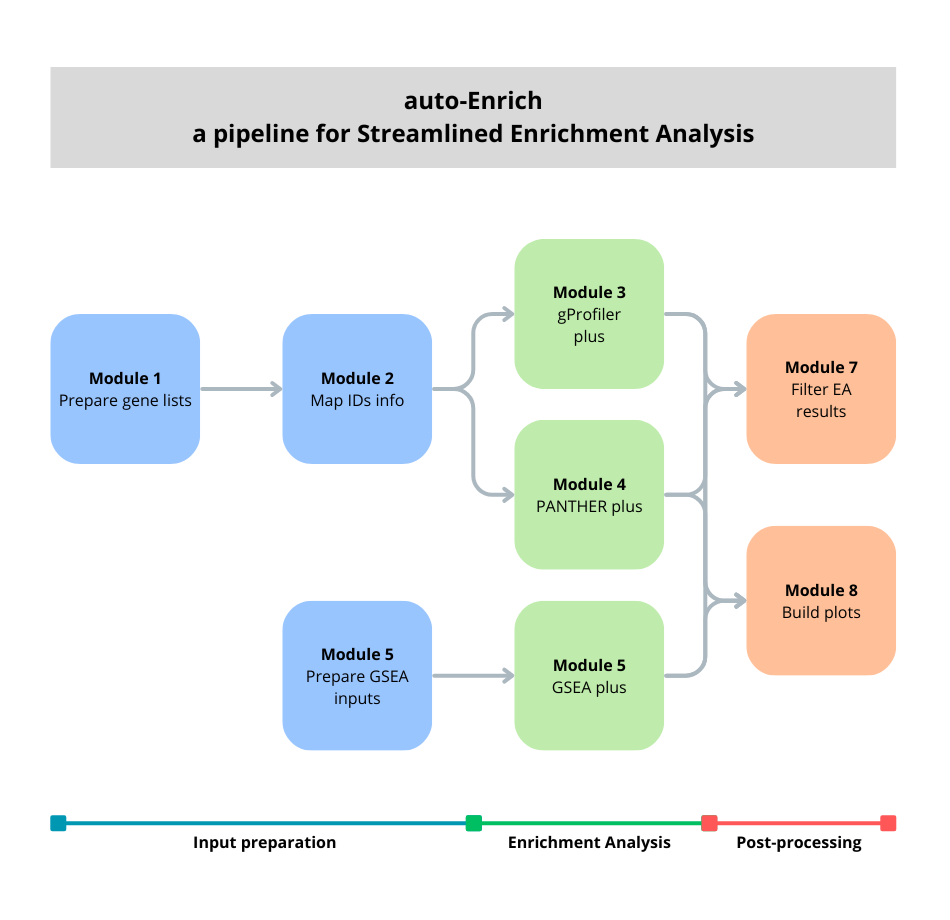

**Overview**
=====================

auto-Enrich is a Bash script-based pipeline that integrademtes multiple
widely used enrichment analysis tools into a single, modular framework.
It is designed to automate enrichment workflows and standardize results.
Packaged as a Docker image, auto-Enrich allows users to perform
comprehensive enrichment analysis with three popular tools: g:Profiler,
PANTHER, and GSEA (Gene Set Enrichment Analysis).

The pipeline includes preparation, enrichment analysis, and
post-processing steps, facilitating end-to-end workflows. Its eight core
modules can be run independently or combined, providing flexibility
depending on analytical needs. Detailed descriptions of each module are
provided in :doc:`Modules <modules>` section.

The auto-Enrich pipeline runs in any computing environment with Docker installed. 
It is distributed as part of the `pegi3s Bioinformatics Docker Images Project <http://bdip.i3s.up.pt/>`_, 
and the corresponding image is available at: `<https://hub.docker.com/r/pegi3s/auto-enrich>`_.  
That page also provides a short guide for installing Docker on both Linux and Windows systems.
Since Docker is widely adopted, additional installation and usage instructions are readily available in the official Docker documentation.

The pipeline supports two primary **input data types**:

- Gene list files
   Text files with one Gene ID per line.  
   Used for **Over-Representation Analysis** by the ``g:Profiler`` and ``PANTHER`` modules.

- Gene expression matrix
   A matrix of gene expression values.  
   Used for **GSEA** (Classic or Preranked).

At a minimum, the pipeline requires **two files**:

- Pipeline configuration file ``config0``
   Specifies modules, species, sources, and post-processing settings.  

- Input file
   At least one gene list or gene expression matrix.

Depending on modules used, up to three additional configuration files may also be necessary.

This pipeline is designed to **simplify and standardize** the following steps:

1. Extract differentially expressed genes from an expression matrix

2. Map Gene ID information (inncludes UniProtKB ID, Gene Symbol, and Description)

3. Run ``g:Profiler`` enrichment analysis, using the ``g:GOSt`` tool.

4. Run ``PANTHER`` analysis statistical overrepresentation test.

5. Prepare inputs for ``GSEA`` (for both Classic and Preranked)

6. Run Gene Set Enrichment Analysis ``GSEA``  

7. Filter enrichment results (to remove non-relevant terms from analysis outputs)

8. Build plots and gene presence matrices (supports time-series visualization)

The pipeline runs in any environment with Docker installed. After
preparing input and configuration files, execute auto-Enrich with:

.. code-block::

    docker run --rm -v /your/working/directory:/data pegi3s/auto_enrich

A mounted directory structure, where the user should **change your/working/directory** to their data directory.

  Overview of the auto-Enrich pipeline.

**Module Index Reference**
==========================

Each module in auto-Enrich is referenced by a **numbered index** defined
in the ``tools=`` variable of the pipeline configuration file (**config0**).
This numbering ensures that modules can be easily called in sequence or
selected individually. Detailed explanations of each module are provided
in later sections.

.. _index_table:

**Module Index Reference Table**

.. table::
   :align: center
   :widths: auto

   +---------+-------------------------------------+-----------------------------+----------------------------------+
   | Module  | Module Name                         | Description                 | Config File                      |
   | #       |                                     |                             | Required                         |
   +=========+=====================================+=============================+==================================+
   | 1       | :ref:`Prepare Gene Lists <module1>` | Generate differentially     | :ref:`config1 <config1>`         |
   |         |                                     | expressed gene lists from   |                                  |
   |         |                                     | expression data             |                                  |
   +---------+-------------------------------------+-----------------------------+----------------------------------+
   | 2       | :ref:`Map IDs info <module2>`       | Maps gene IDs to standard   | –                                |
   |         |                                     | formats (UniProtKB, Gene    |                                  |
   |         |                                     | Symbol and Full Name)       |                                  |
   +---------+-------------------------------------+-----------------------------+----------------------------------+
   | 3       | :ref:`gProfiler plus <module3>`     | Run enrichment analysis     | –                                |
   |         |                                     | with g:Profiler (g:GOSt)    |                                  |
   +---------+-------------------------------------+-----------------------------+----------------------------------+
   | 4       | :ref:`PANTHER plus <module4>`       | Run enrichment analysis     | –                                |
   |         |                                     | with PANTHER                |                                  |
   |         |                                     | Overrepresentation test     |                                  |
   +---------+-------------------------------------+-----------------------------+----------------------------------+
   | 5       | :ref:`Prep GSEA inputs <module5>`   | Create **.rnk**, **.gct**   | :ref:`config5 <config5>`         |
   |         |                                     | and **.cls** files from     |                                  |
   |         |                                     | expression data             |                                  |
   +---------+-------------------------------------+-----------------------------+----------------------------------+
   | 6       | :ref:`GSEA plus <module6>`          | Execute GSEA using          | :ref:`gsea_parameters <config6>` |
   |         |                                     | parameters defined in       |                                  |
   |         |                                     | **gsea_parameters**         |                                  |
   +---------+-------------------------------------+-----------------------------+----------------------------------+
   | 7       | :ref:`Filter EA results <module7>`  | Filter enriched terms       | :ref:`config0 <config0>`         |
   |         |                                     | from enrichment analysis    |                                  |
   +---------+-------------------------------------+-----------------------------+----------------------------------+
   | 8       | :ref:`Build plots <module8>`        | Build time-series plots for | :ref:`config0 <config0>`         |
   |         |                                     | enriched terms and gene     |                                  |
   |         |                                     | presence matrices           |                                  |
   +---------+-------------------------------------+-----------------------------+----------------------------------+
